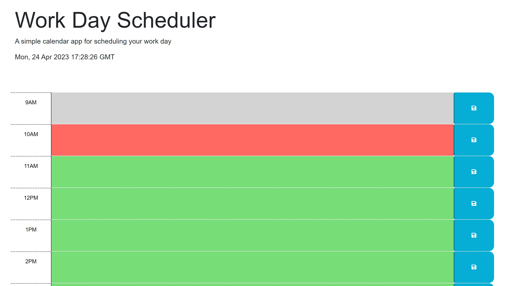

# workday-scheduler

## Description
This is a workday sceduler application. It allows a user to create a to do list between the hours of 9:00 am - 5:00 pm everyday. It displays the date and current time on the top and has all of the time hour slots underneath. Each hour block has its on to do text area where the user can enter a to do item and save it to the local storage, so that it will be there even after they close out of the page. The hour slots are color coded to show if an hour block is either current, in the past, or in the future. 

View From [Here](https://dawsonbolen.github.io/workday-scheduler/)
View the repo from [Here](https://github.com/DawsonBolen/workday-scheduler)

## Installation 
NA

## Usage 
This could be used for students, professionals, or really anyone who wants to improve their scheduling and time management as well as write down tasks so that they won't forget to do them.

## Credits
NA

## License
MIT